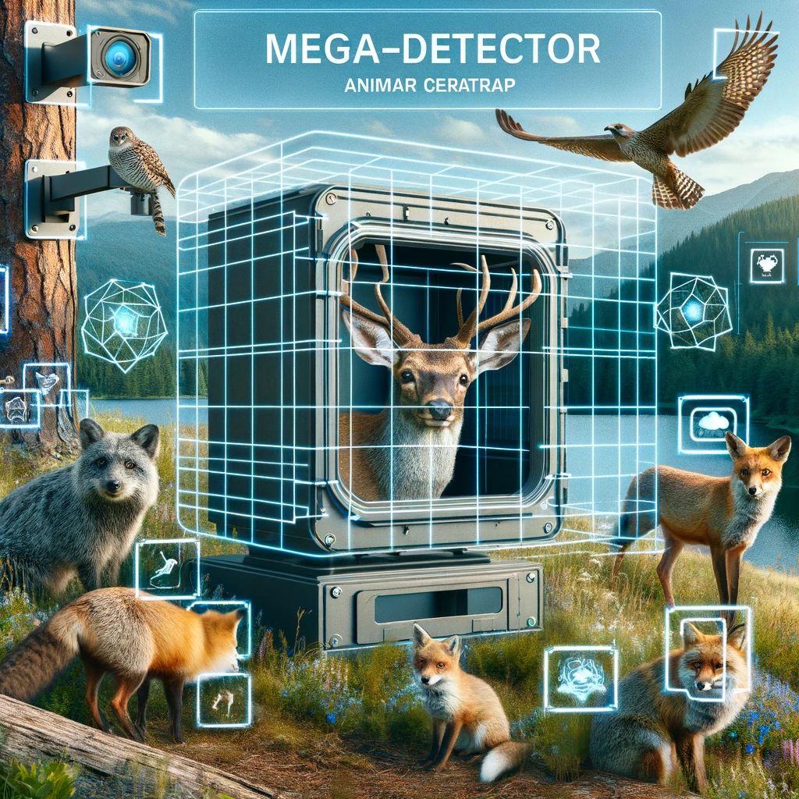

# Detecção de Animais com Visão Computacional em Imagens de Câmeras-Trap
<p align="center">
  
</p>
Projeto de detecção automatizada de animais em imagens de armadilhas fotográficas (câmeras-trap) utilizando as ferramentas MegaDetector e YOLOv5. Utilizado para objetivos como monitorar a biodiversidade de forma eficiente, identificando automaticamente os animais presentes nas imagens coletadas.

## Funcionalidades
- Detecção automatizada de animais em imagens de câmeras-trap.
- Processamento em lote de imagens para detecção.
- Visualização das detecções com caixas delimitadoras.
- Exportação dos resultados.

## Estrutura do Projeto
- `md_local.ipynb`: Notebook para executar o projeto com o MegaDetector localmente.
- `vc_cameras_trap.ipynb`: Notebook focado na aplicação prática com requisitos acessados remotamente.
- `/img_entrada`: Diretório para as imagens de entrada.
- `/img_saida`: Diretório para as imagens de saída.

## Requisitos
- `humanfriendly`
- `jsonpickle`
- `ultralytics`
- `torch`
- `gdown`
- `os`

## Uso
1. Configure a instância do Google Colab para usar GPU.
2. Instale as dependências necessárias:
3. Clone os repositórios necessários:
   - [MegaDetector](https://github.com/agentmorris/MegaDetector.git)
   - [YOLOv5](https://github.com/ultralytics/yolov5)
   - [Modelo treinado v5a](https://github.com/agentmorris/MegaDetector/releases/download/v5.0/md_v5a.0.0.pt)
4. Use a `/img_entrad` para carregar a base de imagens, ou indique a url do folder do Google Drive:
5. Se executada no Google Colab, defina o PYTHONPATH para incluir MegaDetector e YOLOv5:
   ```python
   import os
   os.environ['PYTHONPATH'] += ":/content/MegaDetector"
   os.environ['PYTHONPATH'] += ":/content/yolov5"
   ```
6. Execute a detecção:
7. Visualize os resultados:

## Referências
- Hines, G.; et al. Aggregating User Input in Ecology Citizen Science Projects. 2015, pp. 3975-3980. [https://doi.org/10.1609/aaai.v29i2.19057](https://doi.org/10.1609/aaai.v29i2.19057).
- Novoa, S.; Ledesma, K.; Linares, R. Use of Camera Traps to Monitor the Fauna Associated with a Cactus Community in the Coastal Desert of Ica, Peru. Cactus and Succulent Journal, 94, 28 - 33. 2022. [https://doi.org/10.2985/015.094.0105](https://doi.org/10.2985/015.094.0105).
- Roy, Satyabrata; et al. Innovations in Computational Intelligence and Computer Vision: Proceedings of ICICV 2021. Cham, Switzerland: Springer Nature, 2022.

## Autor
- [@abner-lucas](https://github.com/abner-lucas)
  
## Licença
Este projeto está licenciado sob a licença MIT. Veja o arquivo [MIT](https://choosealicense.com/licenses/mit/) para mais detalhes
